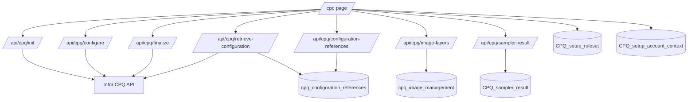
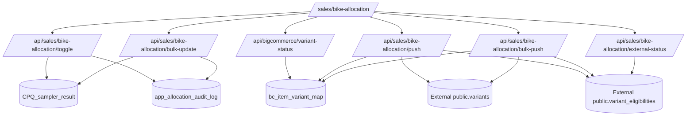
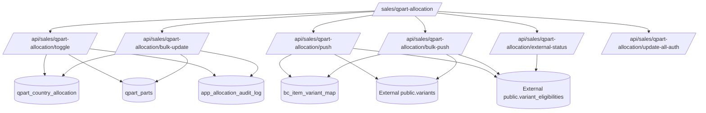

# TP2 CPQ App API Route and Message Flow Map

# Verification status

This document was generated from static code inspection on 2026-06-04. Runtime behavior, production environment variables, production permissions, and external system availability were not exercised here.

Status labels used below:
- **Verified from code** — directly traced in `app/`, `components/`, `lib/`, `sql/`, `scripts/`, or `database-intelligence/live-neon/`.
- **Partially verified** — route/service structure is visible, but full runtime shape depends on external APIs, environment, or dynamic JSON.
- **Unknown from static inspection** — not inferable without running the app or external services.
- **Needs runtime verification** — important behavior should be verified against live CPQ, BigCommerce, Vercel Blob, OpenAI, Neon, or external PostgreSQL.

Scope note: this is a documentation-only map. It intentionally does not fix or alter any route, feature, runtime behavior, database schema, or existing documentation.

## Inspection summary

| Item | Count / status |
|---|---:|
| API route files scanned | 62 |
| Exported GET handlers mapped | 24 |
| Exported POST handlers mapped | 40 |
| Exported PUT handlers mapped | 10 |
| Exported PATCH handlers mapped | 1 |
| Exported DELETE handlers mapped | 8 |
| Total exported API methods mapped | 83 |
| App pages found and mapped | 22 |
| Frontend/internal API caller links found | 65 |
| Static fetch/API search hits reviewed | 206 |

## Source-of-truth files inspected

Primary source of truth was actual code under `app/`, `app/api/`, `components/`, `lib/`, `sql/`, `scripts/`, and `database-intelligence/live-neon/`.

Supporting docs were considered context only and not treated as authoritative: `README.md`, `docs/ARCHITECTURE.md`, `docs/PROCESSDATA.md`, `docs/PAGES_AND_COMPONENTS.md`, `docs/PAGE_DATA_POINTS.md`, `docs/AUTH_AND_PERMISSIONS.md`, `docs/DATABASE.md`, `docs/EXTERNAL_POSTGRES_ROW_PUSH.md`, `docs/CPQ_API_PAYLOADS.md`, `docs/CPQ_DATABASE_SAVE_FLOW.md`, `docs/NEON_USAGE_REDUCTION_AUDIT.md`, and `docs/ENVIRONMENT_VARIABLES.md`.

# Full API route inventory

Status: **Verified from code** for route files, exported methods, visible request/response shapes, visible helper calls, visible tables, visible external systems, and visible permission checks. Unknown fields are marked **Unknown from static inspection**.

## Auth

| Area | Method | API route | Route file | Called from screen/page | Caller component/function | Trigger / when it fires | Request params/body | Response shape | Service/helper called | Tables read | Tables written | External systems | Permission required | Notes / risks |
|---|---|---|---|---|---|---|---|---|---|---|---|---|---|---|
| Auth | POST | `/api/auth/login` | `app/api/auth/login/route.ts` | `/login` | `app/login/page.tsx` `submit` | Login button | JSON `email`, `password` | `{ user }` or `{ error }` | `authenticateUser`, `createSession`, `getCurrentUser` | `app_users`, `app_sessions`, `app_user_page_permissions` | `app_users.last_login_at`, `app_sessions` | Neon/Postgres | None before login; credential check only | Creates session cookie; no page permission expected. |
| Auth | POST | `/api/auth/logout` | `app/api/auth/logout/route.ts` | Global shell/user status | `components/auth/user-status.tsx` | Logout action | none | `{ ok: true }` | `clearSession` | none visible | `app_sessions` delete | Neon/Postgres | No server-side permission check found in static inspection | Depends on session cookie. |
| Auth | GET | `/api/auth/me` | `app/api/auth/me/route.ts` | `/login`, access gates/nav | `app/login/page.tsx`, `components/auth/use-current-user.ts` | Test current login; auth hydration | none | `{ user }` | `getCurrentUser` | `app_sessions`, `app_users`, `app_user_page_permissions` | none | Neon/Postgres | Session optional | Returns null user when unauthenticated. |

## Setup Users / Permissions

| Area | Method | API route | Route file | Called from screen/page | Caller component/function | Trigger / when it fires | Request params/body | Response shape | Service/helper called | Tables read | Tables written | External systems | Permission required | Notes / risks |
|---|---|---|---|---|---|---|---|---|---|---|---|---|---|---|
| Setup Users / Permissions | GET | `/api/setup/permission-pages` | `app/api/setup/permission-pages/route.ts` | `/setup/users` | `components/setup/user-management-page.tsx` | Initial load | none | rows/list of permission pages | `listPermissionPages` | `app_permission_pages` | none | Neon/Postgres | No server-side permission check found in static inspection | Client page is gated, API is not visibly gated. |
| Setup Users / Permissions | GET | `/api/setup/users` | `app/api/setup/users/route.ts` | `/setup/users` | `components/setup/user-management-page.tsx` | Initial load/reload | none | `{ rows }` | `guard`, `listUsers` | `app_users`; `app_sessions`/permissions for guard | none | Neon/Postgres | Edit access to `setup.users` or system admin; unauthenticated guard behavior returns true if no user | Risk: guard allows when `getCurrentUser()` returns null in static code. Needs runtime verification. |
| Setup Users / Permissions | POST | `/api/setup/users` | `app/api/setup/users/route.ts` | `/setup/users` | `components/setup/user-management-page.tsx` | Create user form save | JSON `email`, `displayName`, `password`, `isActive`, `isSystemAdmin`, `permissions` | `{ row }` or `{ error }` | `guard`, `createUser` | `app_users`; guard tables | `app_users`, `app_user_page_permissions` | Neon/Postgres | Edit access to `setup.users` or system admin; see guard note | Writes password hash and page permissions. |
| Setup Users / Permissions | GET | `/api/setup/users/[id]` | `app/api/setup/users/[id]/route.ts` | `/setup/users` | `components/setup/user-management-page.tsx` | Edit user selection | route param `id` | `{ user, permissions }` or `{ error }` | `guard`, inline SQL | `app_users`, `app_user_page_permissions`; guard tables | none | Neon/Postgres | Edit access to `setup.users` or system admin; see guard note | Direct SQL returns selected user and permissions. |
| Setup Users / Permissions | PUT | `/api/setup/users/[id]` | `app/api/setup/users/[id]/route.ts` | `/setup/users` | `components/setup/user-management-page.tsx` | Save existing user | route param `id`; JSON user fields and `permissions` | `{ ok: true }` or `{ error }` | `guard`, `updateUser` | guard tables | `app_users`, `app_user_page_permissions` | Neon/Postgres | Edit access to `setup.users` or system admin; see guard note | Password update only if supplied. |
| Setup Users / Permissions | PATCH | `/api/setup/users/[id]/status` | `app/api/setup/users/[id]/status/route.ts` | `/setup/users` | `components/setup/user-management-page.tsx` | Activate/deactivate user | route param `id`; JSON `isActive` | `{ ok: true }` | `getCurrentUser`, `canAdminPage`, inline SQL | `app_sessions`, `app_users`, `app_user_page_permissions` | `app_users.is_active` | Neon/Postgres | Admin on `setup.users` or system admin when user exists; unauthenticated path not forbidden in visible code | Needs runtime/security review. |

## CPQ runtime

| Area | Method | API route | Route file | Called from screen/page | Caller component/function | Trigger / when it fires | Request params/body | Response shape | Service/helper called | Tables read | Tables written | External systems | Permission required | Notes / risks |
|---|---|---|---|---|---|---|---|---|---|---|---|---|---|---|
| CPQ runtime | POST | `/api/cpq/init` | `app/api/cpq/init/route.ts` | `/cpq` | `components/cpq/bike-builder-page.tsx` | Start configurator/session | JSON context/ruleset/account/country/prefill; trace header optional | `{ traceId, raw, state, context }`-style normalized state or error | `buildStartConfigurationPayload`, `startConfiguration`, `mapCpqToNormalizedState`, mock fallback | Setup context/rules may be used by caller; route itself no DB visible | none | Infor CPQ API unless mock mode | No server-side permission check found in static inspection | External API call; potentially heavy CPQ JSON. |
| CPQ runtime | POST | `/api/cpq/configure` | `app/api/cpq/configure/route.ts` | `/cpq` | `components/cpq/bike-builder-page.tsx` | Option/feature selection change | JSON `sessionId`, feature/option selection, context | normalized CPQ state with `traceId` or error | `configureConfiguration`, `mapCpqToNormalizedState`, mock helpers | none visible | none | Infor CPQ API unless mock mode | No server-side permission check found in static inspection | Called repeatedly during configuration; external API and heavy JSON risk. |
| CPQ runtime | POST | `/api/cpq/finalize` | `app/api/cpq/finalize/route.ts` | `/cpq` | `components/cpq/bike-builder-page.tsx` | Finalize configuration | JSON CPQ session/detail/context | normalized finalized state with `traceId` | `finalizeConfiguration`, `mapCpqToNormalizedState` | none visible | none | Infor CPQ API | No server-side permission check found in static inspection | External API; finalize payload/response can be large. |
| CPQ runtime | POST | `/api/cpq/retrieve-configuration` | `app/api/cpq/retrieve-configuration/route.ts` | `/cpq` | `components/cpq/bike-builder-page.tsx` | Replay/copy existing configuration | JSON `configurationReference` and optional context | normalized CPQ state with reference resolution | `resolveConfigurationReferenceLite`, `startConfiguration`, `mapCpqToNormalizedState` | `cpq_configuration_references` | none | Infor CPQ API, Neon/Postgres | No server-side permission check found in static inspection | Reads DB and calls CPQ; needs runtime verification. |
| CPQ runtime | POST | `/api/cpq/configuration-references` | `app/api/cpq/configuration-references/route.ts` | `/cpq` | `components/cpq/bike-builder-page.tsx` | Save finalized reference | JSON reference, detail/header/ruleset/namespace/account/country/snapshot fields | `{ traceId, row }` or error | `saveConfigurationReference` | possible existing reference via upsert/lookup | `cpq_configuration_references` | Neon/Postgres | No server-side permission check found in static inspection | Large `json_snapshot` reduced but still JSONB. |
| CPQ runtime | GET | `/api/cpq/configuration-references` | `app/api/cpq/configuration-references/route.ts` | `/cpq` | `components/cpq/bike-builder-page.tsx` | Resolve reference | query `configuration_reference` | `{ traceId, row }`, 404, or error | `resolveConfigurationReferenceFull` | `cpq_configuration_references` | none | Neon/Postgres | No server-side permission check found in static inspection | Uses `select *` in helper; full snapshot response risk. |
| CPQ runtime | POST | `/api/cpq/sampler-result` | `app/api/cpq/sampler-result/route.ts` | `/cpq` | `components/cpq/bike-builder-page.tsx` | Persist sampler/finalized result | JSON sampler result fields including ruleset/account/country/ipn/options/snapshots | `{ ok: true, row }` or error | `persistSamplerResult` | none visible | `CPQ_sampler_result` | Neon/Postgres | No server-side permission check found in static inspection | Large JSON payload/body and DB JSONB write risk. |
| CPQ runtime | POST | `/api/cpq/image-layers` | `app/api/cpq/image-layers/route.ts` | `/cpq` | `components/cpq/bike-builder-page.tsx` | Resolve selected option image layers | JSON selected feature/option rows | `{ layers }` | `resolveImageLayersForSelectedOptions` | `cpq_image_management` | none | Neon/Postgres | No server-side permission check found in static inspection | May be called after CPQ state changes. |

## CPQ setup and picture management

| Area | Method | API route | Route file | Called from screen/page | Caller component/function | Trigger / when it fires | Request params/body | Response shape | Service/helper called | Tables read | Tables written | External systems | Permission required | Notes / risks |
|---|---|---|---|---|---|---|---|---|---|---|---|---|---|---|
| CPQ setup | GET | `/api/cpq/setup/account-context` | `app/api/cpq/setup/account-context/route.ts` | `/cpq/setup`, `/cpq` | `CpqSetupPage.load`, `BikeBuilderPage` | Setup tab load; CPQ dropdown load | query `activeOnly` | `{ rows }` | `listAccountContexts` | `CPQ_setup_account_context`, `cpq_country_mappings` | none | Neon/Postgres | Read on `cpq.setup` | Query can return all active/inactive contexts. |
| CPQ setup | POST | `/api/cpq/setup/account-context` | same | `/cpq/setup?tab=accounts` | `CpqSetupPage.saveAccount` | Create account context | JSON account/currency/language/region/country/is_active | `{ row }` | `createAccountContext` | country mappings | `CPQ_setup_account_context` | Neon/Postgres | Edit on `cpq.setup` | Writes setup data. |
| CPQ setup | PUT | `/api/cpq/setup/account-context/[id]` | `app/api/cpq/setup/account-context/[id]/route.ts` | `/cpq/setup?tab=accounts` | `CpqSetupPage.saveAccount` | Update account context | route `id`; JSON account fields | `{ row }` | `updateAccountContext` | country mappings | `CPQ_setup_account_context` | Neon/Postgres | Edit on `cpq.setup` | Validates id. |
| CPQ setup | DELETE | `/api/cpq/setup/account-context/[id]` | same | `/cpq/setup?tab=accounts` | `CpqSetupPage.deleteAccount` | Delete account context | route `id` | `{ ok: true }` | `deleteAccountContext` | none | `CPQ_setup_account_context` delete | Neon/Postgres | Edit on `cpq.setup` | Destructive endpoint, gated. |
| CPQ setup | GET | `/api/cpq/setup/country-mappings` | `app/api/cpq/setup/country-mappings/route.ts` | `/cpq/setup` | `CpqSetupPage.load` | Setup load | query `activeOnly` | `{ rows }` | `listCountryMappings` | `cpq_country_mappings` | none | Neon/Postgres | Read on `cpq.setup` | Also used by services for country lists. |
| CPQ setup | POST | `/api/cpq/setup/country-mappings` | same | `/cpq/setup?tab=accounts` | `CpqSetupPage.saveCountryMapping` | Create mapping | JSON `region`, `sub_region`, `country_code`, `is_active` | `{ row }` | `createCountryMapping` | none | `cpq_country_mappings` | Neon/Postgres | Edit on `cpq.setup` | Writes setup data. |
| CPQ setup | PUT | `/api/cpq/setup/country-mappings/[id]` | `app/api/cpq/setup/country-mappings/[id]/route.ts` | `/cpq/setup?tab=accounts` | `CpqSetupPage.saveCountryMapping` | Update mapping | route `id`; JSON mapping fields | `{ row }` | `updateCountryMapping` | none | `cpq_country_mappings` | Neon/Postgres | Edit on `cpq.setup` | Validates id. |
| CPQ setup | DELETE | `/api/cpq/setup/country-mappings/[id]` | same | `/cpq/setup?tab=accounts` | `CpqSetupPage.deleteCountryMapping` | Delete mapping | route `id` | `{ ok: true }` | `deleteCountryMapping` | none | `cpq_country_mappings` delete | Neon/Postgres | Edit on `cpq.setup` | Destructive endpoint, gated. |
| CPQ setup | GET | `/api/cpq/setup/rulesets` | `app/api/cpq/setup/rulesets/route.ts` | `/cpq/setup`, `/cpq` | `CpqSetupPage.load`, `BikeBuilderPage` | Setup load; CPQ ruleset dropdown | query `activeOnly` | `{ rows }` | `listRulesets` | `CPQ_setup_ruleset` | none | Neon/Postgres | Read on `cpq.setup` | Returns setup rulesets. |
| CPQ setup | POST | `/api/cpq/setup/rulesets` | same | `/cpq/setup?tab=rulesets` | `CpqSetupPage.saveRuleset` | Create ruleset | JSON `cpq_ruleset`, `description`, `bike_type`, `namespace`, `header_id`, `sort_order`, `is_active` | `{ row }` | `createRuleset` | none | `CPQ_setup_ruleset` | Neon/Postgres | Edit on `cpq.setup` | Writes CPQ setup. |
| CPQ setup | PUT | `/api/cpq/setup/rulesets/[id]` | `app/api/cpq/setup/rulesets/[id]/route.ts` | `/cpq/setup?tab=rulesets` | `CpqSetupPage.saveRuleset` | Update ruleset | route `id`; JSON ruleset fields | `{ row }` | `updateRuleset` | none | `CPQ_setup_ruleset` | Neon/Postgres | Edit on `cpq.setup` | Validates id. |
| CPQ setup | DELETE | `/api/cpq/setup/rulesets/[id]` | same | `/cpq/setup?tab=rulesets` | `CpqSetupPage.deleteRuleset` | Delete ruleset | route `id` | `{ ok: true }` | `deleteRuleset` | none | `CPQ_setup_ruleset` delete | Neon/Postgres | Edit on `cpq.setup` | Destructive endpoint, gated. |
| CPQ picture management | GET | `/api/cpq/setup/picture-management` | `app/api/cpq/setup/picture-management/route.ts` | `/cpq/setup?tab=pictures`, `/cpq` | `CpqSetupPage.loadPictures`, `BikeBuilderPage` | Picture tab load; layer support | query `featureLabel`, `onlyMissingPicture` | `{ rows }` | `listImageManagementRows` | `cpq_image_management` | none | Neon/Postgres | Read on `cpq.setup` | Potential large unpaginated response. |
| CPQ picture management | PUT | `/api/cpq/setup/picture-management/[id]` | `app/api/cpq/setup/picture-management/[id]/route.ts` | `/cpq/setup?tab=pictures` | `CpqSetupPage.savePicture` | Save image row draft | route `id`; JSON image URL/order/flags | `{ row }` | `updateImageManagementRow` | none | `cpq_image_management` | Neon/Postgres | Edit on `cpq.setup` | Writes image metadata. |
| CPQ picture management | PUT | `/api/cpq/setup/picture-management/feature-flags` | `app/api/cpq/setup/picture-management/feature-flags/route.ts` | `/cpq/setup?tab=pictures` | `CpqSetupPage.updateFeatureFlags` | Toggle feature-layer settings | JSON `featureLabel`, `featureLayerOrder`, `ignoreDuringConfigure` | `{ ok: true }` | `setImageFeatureSettings` | none | `cpq_image_management` | Neon/Postgres | Edit on `cpq.setup` | Bulk feature update. |
| CPQ picture management | GET | `/api/cpq/setup/picture-management/ignored-features` | `app/api/cpq/setup/picture-management/ignored-features/route.ts` | `/cpq` | `BikeBuilderPage` | CPQ load/configure support | none | `{ featureLabels }` | `listIgnoredFeatureLabelsForConfigure` | `cpq_image_management` | none | Neon/Postgres | Read on `cpq.setup` | Used to suppress features during configure. |
| CPQ picture management | POST | `/api/cpq/setup/picture-management/sync` | `app/api/cpq/setup/picture-management/sync/route.ts` | `/cpq/setup?tab=pictures` | `CpqSetupPage.syncPictures` | Sync picture rows from sampler results | none | `{ ok, summary }` or error | `syncImageManagementFromSampler` | `CPQ_sampler_result`, `cpq_image_management` | `CPQ_sampler_result` processed flag; `cpq_image_management` inserts/updates | Neon/Postgres | Edit on `cpq.setup` | Bulk DB operation; can scan sampler rows. |

## Bike allocation

| Area | Method | API route | Route file | Called from screen/page | Caller component/function | Trigger / when it fires | Request params/body | Response shape | Service/helper called | Tables read | Tables written | External systems | Permission required | Notes / risks |
|---|---|---|---|---|---|---|---|---|---|---|---|---|---|---|
| Bike allocation | POST | `/api/sales/bike-allocation/launch-context` | `app/api/sales/bike-allocation/launch-context/route.ts` | `/sales/bike-allocation` | `SalesBikeAllocationTable` | Launch CPQ from row | JSON row context such as `ruleset`, `ipnCode`, `countryCode` | launch context/prefill | `resolveConfiguratorLaunchContext` | `CPQ_sampler_result`, `CPQ_setup_ruleset`, account context | none | Neon/Postgres | Read on `PAGE_KEYS.bike` | Used to build `/cpq` link. |
| Bike allocation | POST | `/api/sales/bike-allocation/toggle` | `app/api/sales/bike-allocation/toggle/route.ts` | `/sales/bike-allocation` | `SalesBikeAllocationTable` | Toggle single cell | JSON `ruleset`, `ipnCode`, `countryCode`, `active` | updated result, audit/sync info | `updateAllocationCellStatus`, `getCurrentUser` | `CPQ_sampler_result`, `bc_item_variant_map` | `CPQ_sampler_result`, `app_allocation_audit_log`; maybe external via service | Neon/Postgres; may call External PostgreSQL | Edit on `PAGE_KEYS.bike` | Writes local and may push externally when BC OK. |
| Bike allocation | POST | `/api/sales/bike-allocation/bulk-update` | `app/api/sales/bike-allocation/bulk-update/route.ts` | `/sales/bike-allocation` | `SalesBikeAllocationTable` | Bulk activate/deactivate | JSON selected `ruleset`/`ipnCodes`/`countryCodes`/target status/scope | `{ ok, updatedCount, ... }` | `bulkUpdateAllocationStatus`, `getCurrentUser` | `CPQ_sampler_result`, `bc_item_variant_map` | `CPQ_sampler_result`, `app_allocation_audit_log`; maybe external by service | Neon/Postgres; may call External PostgreSQL | Edit on `PAGE_KEYS.bike` | Large body and bulk write risk. |
| Bike allocation | POST | `/api/sales/bike-allocation/push` | `app/api/sales/bike-allocation/push/route.ts` | `/sales/bike-allocation` | `SalesBikeAllocationTable` | Push one row/cell externally | JSON `sku`, `countryCode`, optional active/detail context | sync result | `syncBikeAllocationToExternalIfBcOk` | `bc_item_variant_map`, `cpq_sampler_result`, `cpq_configuration_references` | External `variants`, `variant_eligibilities` | External PostgreSQL, Neon/Postgres | Edit on `PAGE_KEYS.bike` | Writes external PostgreSQL. |
| Bike allocation | POST | `/api/sales/bike-allocation/bulk-push` | `app/api/sales/bike-allocation/bulk-push/route.ts` | `/sales/bike-allocation` | `SalesBikeAllocationTable` | Bulk push BC-OK rows | JSON selected rows/filters | push summary | `pushBikeAllocationBcOk` | `CPQ_sampler_result`, `bc_item_variant_map` | External `variants`, `variant_eligibilities`; audit metadata possible | External PostgreSQL, Neon/Postgres | Edit on `PAGE_KEYS.bike` | Bulk external write risk. |
| Bike allocation | POST | `/api/sales/bike-allocation/external-status` | `app/api/sales/bike-allocation/external-status/route.ts` | `/sales/bike-allocation` | `SalesBikeAllocationTable` | Check external status | JSON `targets`/`rows` skus and countries | external status map/rows | `lookupExternalVariantEligibilityStatuses`, normalization helper | External `variant_eligibilities`; local map for target derivation | none | External PostgreSQL | Read on `PAGE_KEYS.bike` | External read; large payload max/loop risk. |

## QPart allocation

| Area | Method | API route | Route file | Called from screen/page | Caller component/function | Trigger / when it fires | Request params/body | Response shape | Service/helper called | Tables read | Tables written | External systems | Permission required | Notes / risks |
|---|---|---|---|---|---|---|---|---|---|---|---|---|---|---|
| QPart allocation | POST | `/api/sales/qpart-allocation/toggle` | `app/api/sales/qpart-allocation/toggle/route.ts` | `/sales/qpart-allocation` | `SalesQPartAllocationTable` | Toggle single part/country | JSON `partId`, `countryCode`, `active` | updated result/sync rows | `toggleQPartCountryAllocation`, `syncQPartCountryAllocationRows`, `getCurrentUser` | `qpart_parts`, `qpart_country_allocation`, `bc_item_variant_map` | `qpart_country_allocation`, `app_allocation_audit_log`; sync may insert allocations | Neon/Postgres; may call External PostgreSQL | Edit on `PAGE_KEYS.qpart` | Writes local allocation; external push separated/conditional. |
| QPart allocation | POST | `/api/sales/qpart-allocation/bulk-update` | `app/api/sales/qpart-allocation/bulk-update/route.ts` | `/sales/qpart-allocation` | `SalesQPartAllocationTable` | Bulk activate/deactivate | JSON selected `partIds`, `countryCodes`, target status, update-all token for broad scope | summary/counts | `bulkUpdateQPartCountryAllocation`, `syncQPartCountryAllocationRows`, token verifier | `qpart_parts`, `qpart_country_allocation`, `bc_item_variant_map` | `qpart_country_allocation`, `app_allocation_audit_log` | Neon/Postgres | Edit on `PAGE_KEYS.qpart`; update-all cookie token may be required | Large bulk body/write risk. |
| QPart allocation | POST | `/api/sales/qpart-allocation/push` | `app/api/sales/qpart-allocation/push/route.ts` | `/sales/qpart-allocation` | `SalesQPartAllocationTable` | Push single part/country externally | JSON part/country/SKU context | sync result | `syncQPartAllocationToExternalIfBcOk` | `qpart_parts`, `bc_item_variant_map` | External `variants`, `variant_eligibilities` | External PostgreSQL, Neon/Postgres | Edit on `PAGE_KEYS.qpart` | Writes external PostgreSQL. |
| QPart allocation | POST | `/api/sales/qpart-allocation/bulk-push` | `app/api/sales/qpart-allocation/bulk-push/route.ts` | `/sales/qpart-allocation` | `SalesQPartAllocationTable` | Bulk external push | JSON selected parts/countries/scope, update-all token for broad scope | push summary | `bulkPushQPartAllocationBcOk`, `syncQPartCountryAllocationRows`, token verifier | `qpart_parts`, `qpart_country_allocation`, `bc_item_variant_map` | External `variants`, `variant_eligibilities` | External PostgreSQL, Neon/Postgres | Edit on `PAGE_KEYS.qpart` | Bulk external write risk. |
| QPart allocation | POST | `/api/sales/qpart-allocation/external-status` | `app/api/sales/qpart-allocation/external-status/route.ts` | `/sales/qpart-allocation` | `SalesQPartAllocationTable` | Check external statuses | JSON targets/part rows | status rows/map | `lookupExternalVariantEligibilityStatuses` | External `variant_eligibilities`; local QPart data for target expansion | none | External PostgreSQL | Read on `PAGE_KEYS.qpart` | External read; large target list risk. |
| QPart allocation | POST | `/api/sales/qpart-allocation/update-all-auth` | `app/api/sales/qpart-allocation/update-all-auth/route.ts` | `/sales/qpart-allocation` | `SalesQPartAllocationTable` | Authorize broad update all action | JSON passphrase/token intent | token/cookie result | `issueQPartUpdateAllToken`, `verifyQPartUpdateAllPassphrase` | none visible | response cookie | Browser cookie | Edit on `PAGE_KEYS.qpart` | Sensitive control for bulk operations. |

## Allocation audit

| Area | Method | API route | Route file | Called from screen/page | Caller component/function | Trigger / when it fires | Request params/body | Response shape | Service/helper called | Tables read | Tables written | External systems | Permission required | Notes / risks |
|---|---|---|---|---|---|---|---|---|---|---|---|---|---|---|
| Allocation audit | GET | `/api/sales/allocation-audit` | `app/api/sales/allocation-audit/route.ts` | `/sales/allocation-audit` | `AllocationAuditPageClient.runSearch` | Search by item | query `itemCode`, `entityType`, `sort` | `{ rows }` | `getAllocationAuditHistory` | `app_allocation_audit_log` | none | Neon/Postgres | Read on `PAGE_KEYS.salesAllocationAudit` | No visible pagination; search can return many rows depending service limit. |

## QPart PIM / parts / metadata / hierarchy / compatibility

| Area | Method | API route | Route file | Called from screen/page | Caller component/function | Trigger / when it fires | Request params/body | Response shape | Service/helper called | Tables read | Tables written | External systems | Permission required | Notes / risks |
|---|---|---|---|---|---|---|---|---|---|---|---|---|---|---|
| QPart PIM | GET | `/api/qpart/parts` | `app/api/qpart/parts/route.ts` | `/qpart/parts` | `QPartPartsListPage.load` | List/search parts | query filters/page/pageSize/search/hierarchy/status | `{ rows, pagination }` | `listParts` | `qpart_parts`, hierarchy, compatibility tables | none | Neon/Postgres | No server-side permission check found in static inspection | Has pagination in caller; API permission gap. |
| QPart PIM | POST | `/api/qpart/parts` | same | `/qpart/parts/new` | `QPartPartFormPage.save` | Create part | JSON part fields, translations, metadata, bike types, channels, country codes, compatibility rules | `{ row }` | `createPart` | hierarchy/metadata as validation context | `qpart_parts`, translations, metadata values, channels, bike compatibility, compatibility rules, country allocation | Neon/Postgres | No server-side permission check found in static inspection | Large body; writes many tables. |
| QPart PIM | GET | `/api/qpart/parts/[id]` | `app/api/qpart/parts/[id]/route.ts` | `/qpart/parts/[id]` | `QPartPartFormPage.loadPart` | Edit page load | route `id` | `{ row }` | `getPartDetail` | `qpart_parts`, translations, metadata, compatibility, channels, country allocation | none | Neon/Postgres | No server-side permission check found in static inspection | Detail response can be large. |
| QPart PIM | PUT | `/api/qpart/parts/[id]` | same | `/qpart/parts/[id]` | `QPartPartFormPage.save` | Update part | route `id`; JSON full part payload | `{ row }` | `updatePart` | existing part and related rows | `qpart_parts`; deletes/reinserts translations/metadata/channels/bike/compatibility | Neon/Postgres | No server-side permission check found in static inspection | Destructive replace of related rows; large body. |
| QPart PIM | DELETE | `/api/qpart/parts/[id]` | same | Unknown from static inspection | Unknown from static inspection | Delete part | route `id` | `{ ok: true }` | `deletePart` | none visible | `qpart_parts` cascade/related dependent on DB | Neon/Postgres | No server-side permission check found in static inspection | Destructive and not visibly called from UI. |
| QPart images | GET | `/api/qpart/parts/[id]/image` | `app/api/qpart/parts/[id]/image/route.ts` | `/qpart/parts/[id]` | `QPartPartFormPage.loadImages` | Image section load | route `id` | `{ rows, preferred }` | `getPartDetail`, `reconcileQPartImages`, `choosePreferredQPartImage` | `qpart_parts`, `qpart_part_images` | `qpart_part_images` during reconcile | Vercel Blob, Neon/Postgres | No server-side permission check found in static inspection | Lists Vercel Blob up to limit 1000; reconciliation writes metadata. |
| QPart images | POST | `/api/qpart/parts/[id]/image` | same | `/qpart/parts/[id]` | `QPartPartFormPage.uploadImage` | Upload primary/additional image | route `id`; query `mode`; multipart `file` | image row metadata | Vercel Blob PUT, `upsertQPartImageMetadata` | `qpart_parts`, image index | `qpart_part_images`; Vercel Blob object | Vercel Blob, Neon/Postgres | No server-side permission check found in static inspection | Large upload body; external blob write. |
| QPart images | DELETE | `/api/qpart/parts/[id]/image` | same | `/qpart/parts/[id]` | `QPartPartFormPage.deleteImage` | Delete image metadata | route `id`; query `imageId` | `{ ok: true }` | `deleteQPartImageMetadata` | `qpart_part_images` | `qpart_part_images` delete | Neon/Postgres | No server-side permission check found in static inspection | Deletes metadata; blob deletion not visible in route. |
| QPart PIM | GET | `/api/qpart/parts/export` | `app/api/qpart/parts/export/route.ts` | `/qpart/parts`, `/qpart/parts/[id]` | CSV export links | Click Export CSV | query filters or `part_id` | `text/csv` response | `exportPartsCsv` | `qpart_parts` and related part tables | none | Neon/Postgres | No server-side permission check found in static inspection | Large export risk. |
| QPart PIM | POST | `/api/qpart/parts/import` | `app/api/qpart/parts/import/route.ts` | `/qpart/parts` | `QPartPartsListPage.import` | Import CSV | multipart/file or CSV body | import summary/errors | `importPartsCsv` | qpart tables for matching | many qpart tables through create/update | Neon/Postgres | No server-side permission check found in static inspection | Large upload and bulk write risk. |
| QPart metadata | GET | `/api/qpart/metadata` | `app/api/qpart/metadata/route.ts` | `/qpart/metadata`, part form | `QPartMetadataPage.load`, `QPartPartFormPage.loadDependencies` | Load metadata definitions | query `activeOnly` | `{ rows }` | `listMetadataDefinitions` | `qpart_metadata_definitions` | none | Neon/Postgres | No server-side permission check found in static inspection | Unpaginated. |
| QPart metadata | POST | `/api/qpart/metadata` | same | `/qpart/metadata` | `QPartMetadataPage.save` | Create metadata definition | JSON definition fields | `{ row }` | `createMetadataDefinition` | none | `qpart_metadata_definitions` | Neon/Postgres | No server-side permission check found in static inspection | Setup write. |
| QPart metadata | PUT | `/api/qpart/metadata/[id]` | `app/api/qpart/metadata/[id]/route.ts` | `/qpart/metadata` | `QPartMetadataPage.save` | Update definition | route `id`; JSON fields | `{ row }` | `updateMetadataDefinition` | none | `qpart_metadata_definitions` | Neon/Postgres | No server-side permission check found in static inspection | Setup write. |
| QPart metadata | DELETE | `/api/qpart/metadata/[id]` | same | `/qpart/metadata` | `QPartMetadataPage.remove` | Delete definition | route `id` | `{ ok: true }` | `deleteMetadataDefinition` | none | `qpart_metadata_definitions` delete | Neon/Postgres | No server-side permission check found in static inspection | Destructive. |
| QPart hierarchy | GET | `/api/qpart/hierarchy` | `app/api/qpart/hierarchy/route.ts` | `/qpart/hierarchy`, parts screens | `QPartHierarchyPage.load`, part list/form | Load hierarchy | query `level`, active filters | `{ rows }` | `listHierarchyNodes` | `qpart_hierarchy_nodes` | none | Neon/Postgres | No server-side permission check found in static inspection | Unpaginated. |
| QPart hierarchy | POST | `/api/qpart/hierarchy` | same | `/qpart/hierarchy` | `QPartHierarchyPage.save` | Create node | JSON `level`, `code`, `label_en`, `parent_id`, `is_active` | `{ row }` | `createHierarchyNode` | parent nodes | `qpart_hierarchy_nodes` | Neon/Postgres | No server-side permission check found in static inspection | Setup write. |
| QPart hierarchy | PUT | `/api/qpart/hierarchy/[id]` | `app/api/qpart/hierarchy/[id]/route.ts` | `/qpart/hierarchy` | `QPartHierarchyPage.save` | Update node | route `id`; JSON fields | `{ row }` | `updateHierarchyNode` | parent nodes | `qpart_hierarchy_nodes` | Neon/Postgres | No server-side permission check found in static inspection | Setup write. |
| QPart hierarchy | DELETE | `/api/qpart/hierarchy/[id]` | same | `/qpart/hierarchy` | `QPartHierarchyPage.remove` | Delete node | route `id` | `{ ok: true }` | `deleteHierarchyNode` | none | `qpart_hierarchy_nodes` delete | Neon/Postgres | No server-side permission check found in static inspection | Destructive. |
| QPart compatibility | GET | `/api/qpart/compatibility/reference-values` | `app/api/qpart/compatibility/reference-values/route.ts` | `/qpart/compatibility` | `QPartCompatibilityPage.load` | Load reference values | none visible | `{ rows }` | `listReferenceValues` | qpart compatibility reference table(s) | none | Neon/Postgres | No server-side permission check found in static inspection | Unpaginated. |
| QPart compatibility | POST | `/api/qpart/compatibility/reference-values` | same | `/qpart/compatibility` | `QPartCompatibilityPage.save` | Create reference value | JSON reference value fields | `{ row }` | `createReferenceValue` | none | qpart compatibility reference table(s) | Neon/Postgres | No server-side permission check found in static inspection | Setup write. |
| QPart compatibility | PUT | `/api/qpart/compatibility/reference-values/[id]` | `app/api/qpart/compatibility/reference-values/[id]/route.ts` | `/qpart/compatibility` | `QPartCompatibilityPage.save` | Update reference value | route `id`; JSON fields | `{ row }` | `updateReferenceValue` | none | qpart compatibility reference table(s) | Neon/Postgres | No server-side permission check found in static inspection | Setup write. |
| QPart compatibility | DELETE | `/api/qpart/compatibility/reference-values/[id]` | same | `/qpart/compatibility` | `QPartCompatibilityPage.delete` | Delete reference value | route `id` | `{ ok: true }` | `deleteReferenceValue` | none | qpart compatibility reference table(s) delete | Neon/Postgres | No server-side permission check found in static inspection | Destructive. |
| QPart compatibility | POST | `/api/qpart/compatibility/derive` | `app/api/qpart/compatibility/derive/route.ts` | `/qpart/compatibility`, part form | compatibility page/form | Preview/derive compatibility candidates | JSON selected bike types/rules | `{ rows }` | `deriveCompatibilityCandidates` | qpart compatibility reference table(s) | none | Neon/Postgres | No server-side permission check found in static inspection | Pure derivation/read by static inspection. |
| QPart compatibility | GET | `/api/qpart/compatibility` | `app/api/qpart/compatibility/route.ts` | Unknown from static inspection | Unknown from static inspection | Unknown from static inspection | Unknown from static inspection | compatibility rows | compatibility service | qpart compatibility tables | none | Neon/Postgres | No server-side permission check found in static inspection | No frontend caller found. |
| QPart reference | GET | `/api/qpart/bike-types` | `app/api/qpart/bike-types/route.ts` | `/qpart/compatibility`, part form | QPart components | Load bike types | none | `{ bikeTypes }` | `listBikeTypes` | qpart compatibility/reference data | none | Neon/Postgres | No server-side permission check found in static inspection | Reference endpoint. |
| QPart reference | GET | `/api/qpart/countries` | `app/api/qpart/countries/route.ts` | part form | `QPartPartFormPage.loadDependencies` | Load countries | none | `{ countries }` | country/list helper | `cpq_country_mappings` | none | Neon/Postgres | No server-side permission check found in static inspection | Reference endpoint. |
| QPart reference | GET | `/api/qpart/locales` | `app/api/qpart/locales/route.ts` | part form | `QPartPartFormPage.loadDependencies` | Load supported locales | none | `{ locales, baseLocale }` | `listSupportedLocales`, `getBaseLocale` | likely config/static | none | Unknown from static inspection | No server-side permission check found in static inspection | Reference endpoint. |
| QPart translation | POST | `/api/qpart/translations/field` | `app/api/qpart/translations/field/route.ts` | part form | `QPartPartFormPage.translate...` | Translate name/description/metadata field | JSON source text/locale/field context | translated text result | `translateCoreField`, `translateMetadataField` | none visible | none | OpenAI API | No server-side permission check found in static inspection | External OpenAI call; sends content to model. |

## BigCommerce item map / status

| Area | Method | API route | Route file | Called from screen/page | Caller component/function | Trigger / when it fires | Request params/body | Response shape | Service/helper called | Tables read | Tables written | External systems | Permission required | Notes / risks |
|---|---|---|---|---|---|---|---|---|---|---|---|---|---|---|
| BigCommerce item map | POST | `/api/bigcommerce/item-map/lookup` | `app/api/bigcommerce/item-map/lookup/route.ts` | bike/qpart allocation | allocation table clients | Lookup cached BC mapping | JSON `skus` array, max 2500 | `{ items }` | `lookupBigCommerceItemMap` | `bc_item_variant_map` | none | Neon/Postgres | No server-side permission check found in static inspection | Large response; no server-side page permission. |
| BigCommerce item map | POST | `/api/bigcommerce/item-map/upsert` | `app/api/bigcommerce/item-map/upsert/route.ts` | bike/qpart allocation | allocation table clients | Save BC mapping/status | JSON item map fields/SKU details | upsert result | `upsertBigCommerceItemMap` | `bc_item_variant_map` | `bc_item_variant_map` | Neon/Postgres | No server-side permission check found in static inspection | Writes cache/status without page guard. |
| BigCommerce item map | POST | `/api/bigcommerce/variant-status` | `app/api/bigcommerce/variant-status/route.ts` | bike/qpart allocation | allocation table clients | Check live BC status by SKU | JSON `skus` array, max 2500 | `{ items, errorCode? }` | `resolveVariantStatusBySku` | `bc_item_variant_map` | `bc_item_variant_map` status/cache likely | BigCommerce API, Neon/Postgres | No server-side permission check found in static inspection | External API; large SKU payload; no page guard. |

## Admin / data-point and debug / utility

| Area | Method | API route | Route file | Called from screen/page | Caller component/function | Trigger / when it fires | Request params/body | Response shape | Service/helper called | Tables read | Tables written | External systems | Permission required | Notes / risks |
|---|---|---|---|---|---|---|---|---|---|---|---|---|---|---|
| Debug / utility | GET | `/api/admin/db-sequences` | `app/api/admin/db-sequences/route.ts` | `/qpart/admin/sequences` | `QPartSequenceAdminPage.load` | Sequence admin load | none | `{ rows }` | `assertAdminMode`, `listPrimaryKeySequences` | DB function `app_list_pk_sequence_health()` | none | Neon/Postgres | Admin mode assertion | Uses DB function with `select *`. |
| Debug / utility | POST | `/api/admin/db-sequences/resync` | `app/api/admin/db-sequences/resync/route.ts` | `/qpart/admin/sequences` | `QPartSequenceAdminPage.resync` | Resync one/all sequences | JSON `table` or `all: true` | `{ row/rows, scope }` | `assertAdminMode`, sequence service | DB sequence metadata/function | sequences reset via DB function | Neon/Postgres | Admin mode assertion | Operationally sensitive maintenance endpoint. |
| Debug / utility | GET | `/api/debug/external-postgres-test` | `app/api/debug/external-postgres-test/route.ts` | Unknown from static inspection | Unknown from static inspection | Manual diagnostic | none | diagnostic result | `runExternalPgDiagnostics` | External PostgreSQL metadata/test queries | none | External PostgreSQL | No server-side permission check found in static inspection | Debug endpoint exposed if deployed. |
| Debug / utility | POST | `/api/debug/external-postgres-test` | same | Unknown from static inspection | Unknown from static inspection | Manual diagnostic | none | diagnostic result | `runExternalPgDiagnostics` | External PostgreSQL metadata/test queries | none | External PostgreSQL | No server-side permission check found in static inspection | Debug endpoint exposed if deployed. |
| Debug / utility | POST | `/api/debug/external-postgres-write-test` | `app/api/debug/external-postgres-write-test/route.ts` | Unknown from static inspection | Unknown from static inspection | Manual write diagnostic | JSON write-test parameters | staged diagnostic result | external sampler/variant helpers | local/external status tables | External `variants`/`variant_eligibilities` and/or sampler test rows | External PostgreSQL, Neon/Postgres | No server-side permission check found in static inspection | High risk: debug write endpoint. |

# Request/response shape extraction details

Status: **Partially verified**. Important fields are listed from route code and caller payloads; exact TypeScript-level interfaces may be broader.

## CPQ runtime shape notes

- `POST /api/cpq/init`: caller sends selected ruleset/account/country/prefill context; response is normalized bike-builder state plus raw/trace data. Calls Infor CPQ through `startConfiguration` unless mock mode is active.
- `POST /api/cpq/configure`: caller sends `sessionId`, selected feature/option and current context; response is normalized CPQ state. Broad `useEffect`/user-selection call frequency makes it performance-sensitive.
- `POST /api/cpq/finalize`: caller sends current CPQ session/configuration detail; response is finalized normalized CPQ state.
- `POST /api/cpq/configuration-references`: request includes `configuration_reference`, `canonical_header_id`, `canonical_detail_id`, `ruleset`, `namespace`, account/country/source session/detail, and JSON snapshot. Response is `{ traceId, row }`.
- `GET /api/cpq/configuration-references`: query `configuration_reference`. Response is `{ traceId, row }` or 404. Helper uses full-row lookup.
- `POST /api/cpq/sampler-result`: request body contains sampler result fields such as ruleset, namespace/header/detail/session, country/account, selected options/features and snapshot JSON. Response is `{ ok, row }`.

## Allocation shape notes

- `POST /api/sales/bike-allocation/toggle`: request body includes `ruleset`, `ipnCode`, `countryCode`, `active`; response includes update/sync outcome from service.
- `POST /api/sales/bike-allocation/bulk-update`: request body includes target status plus arrays/filter context for rulesets/IPNs/countries; response includes counts and affected targets.
- `POST /api/sales/bike-allocation/push` and `bulk-push`: request includes SKU/IPN/country target context; response includes external sync result.
- `POST /api/sales/bike-allocation/external-status`: request includes target SKU/country rows; response maps external status by target.
- `POST /api/sales/qpart-allocation/toggle`: request body includes `partId`, `countryCode`, `active`; response includes update/sync outcome.
- `POST /api/sales/qpart-allocation/bulk-update` and `bulk-push`: request body includes `partIds`, `countryCodes`, target status/scope and may require update-all token/cookie for broad operations.

## QPart shape notes

- `GET /api/qpart/parts`: query filters include search/status/hierarchy/pagination. Response includes list rows and pagination metadata.
- `POST|PUT /api/qpart/parts`: request body includes `part_number`, `default_name`, `default_description`, `status`, `hierarchy_node_id`, `translations`, `metadata_values`, `bike_types`, `channels`, `country_codes`, `compatibility_rules`. Response is `{ row }`.
- `GET /api/qpart/parts/[id]`: route param `id`; response is `{ row }` containing part detail and related collections.
- `GET|POST|DELETE /api/qpart/parts/[id]/image`: route param `id`; POST uses multipart `file` and query `mode`; DELETE uses query `imageId`. Responses include image rows or `{ ok }`.
- `POST /api/qpart/translations/field`: body identifies source text, source/target locale and field metadata. Response contains translated value or error.

# Data lineage per API route

Status: **Verified from code** for visible Neon/external tables; **Needs runtime verification** for exact external schemas and credentials.

| API family | Tables read | Tables written | External systems |
|---|---|---|---|
| Auth/login/me/logout | `app_users`, `app_sessions`, `app_user_page_permissions` | `app_users.last_login_at`, `app_sessions` insert/delete | Neon/Postgres |
| Setup users | `app_users`, `app_permission_pages`, `app_user_page_permissions`, `app_sessions` for guard | `app_users`, `app_user_page_permissions` | Neon/Postgres |
| CPQ runtime init/configure/finalize/retrieve | `cpq_configuration_references` for retrieve/reference lookup | none for CPQ service calls | Infor CPQ API; Neon/Postgres for reference lookup |
| CPQ configuration reference save/read | `cpq_configuration_references` | `cpq_configuration_references` | Neon/Postgres |
| CPQ sampler result save | none visible | `CPQ_sampler_result` | Neon/Postgres |
| CPQ setup | `CPQ_setup_account_context`, `cpq_country_mappings`, `CPQ_setup_ruleset` | same setup tables | Neon/Postgres |
| CPQ picture management | `cpq_image_management`, `CPQ_sampler_result` | `cpq_image_management`, `CPQ_sampler_result` processed flag | Neon/Postgres |
| Bike allocation | `CPQ_sampler_result`, `CPQ_setup_ruleset`, `CPQ_setup_account_context`, `bc_item_variant_map`, `cpq_configuration_references` | `CPQ_sampler_result`, `app_allocation_audit_log` | Neon/Postgres; External PostgreSQL `public.variants`, `public.variant_eligibilities` on push |
| QPart allocation | `qpart_parts`, `qpart_country_allocation`, `qpart_hierarchy_nodes`, `qpart_metadata_definitions`, `qpart_part_metadata_values`, `bc_item_variant_map`, `cpq_country_mappings` | `qpart_country_allocation`, `app_allocation_audit_log` | Neon/Postgres; External PostgreSQL `public.variants`, `public.variant_eligibilities` on push |
| QPart PIM | `qpart_parts`, `qpart_hierarchy_nodes`, `qpart_part_translations`, `qpart_part_metadata_values`, `qpart_metadata_definitions`, `qpart_part_compatibility_rules`, `qpart_part_channel_assignment`, `qpart_country_allocation`, compatibility reference tables | same qpart PIM tables | Neon/Postgres |
| QPart images | `qpart_parts`, `qpart_part_images` | `qpart_part_images` | Vercel Blob, Neon/Postgres |
| BigCommerce item map/status | `bc_item_variant_map` | `bc_item_variant_map` | BigCommerce API for live variant status; Neon/Postgres cache |
| Dashboard | `cpq_country_mappings`, `CPQ_sampler_result`, `CPQ_setup_ruleset`, `bc_item_variant_map`, `qpart_country_allocation`, `qpart_parts`, `app_allocation_audit_log` | none | Neon/Postgres |
| Debug external PG | external status/variant tables and diagnostics | external test rows depending endpoint | External PostgreSQL |

# Permission mapping per API route

Status: **Verified from code** for visible server-side checks; **Unknown from static inspection** for middleware or deployment-level protection not visible in route files.

| API group | Server-side permission enforcement found | Permission key / level | Client-only enforcement notes |
|---|---|---|---|
| Auth login/me/logout | Login credential/session only; logout no page gate | none | App shell reacts to auth changes. |
| Setup users | Yes, but guard has unauthenticated edge case requiring review | `setup.users` edit/admin/system admin | `/setup/users` wrapped by `UsersAccessClient` and `PageAccessGate`. |
| CPQ runtime | No server-side permission check found in static inspection | none visible | `/cpq` wrapped by `BikeBuilderAccessClient` using `PAGE_KEYS.cpqConfigure`. |
| CPQ setup | Yes | `cpq.setup` read/edit in APIs; page tabs use specific page keys (`cpqSetupAccounts`, `cpqSetupRulesets`, `cpqSetupPictures`) | Client gate exists, API uses broader `cpq.setup`. |
| Sales bike allocation | Yes | `PAGE_KEYS.bike` read/edit | Server component also checks page read and passes `canEdit`. |
| Sales qpart allocation | Yes | `PAGE_KEYS.qpart` read/edit | Server component checks read; bulk update-all uses extra cookie token. |
| Allocation audit | Yes | `PAGE_KEYS.salesAllocationAudit` read | Server page checks read. |
| QPart PIM/reference APIs | No server-side permission check found in static inspection | none visible | Page-level gating was not visible in route files. |
| BigCommerce item-map/status APIs | No server-side permission check found in static inspection | none visible | Called by allocation pages that have page checks. |
| Debug/admin sequence APIs | Admin sequence uses `assertAdminMode`; debug external PG has no visible permission check | admin mode for sequence routes; none for debug routes | `/qpart/admin/sequences` page itself has no visible page gate in page file. |

## API routes with no server-side permission check found in static inspection

`/api/auth/logout`, `/api/bigcommerce/item-map/lookup`, `/api/bigcommerce/item-map/upsert`, `/api/bigcommerce/variant-status`, `/api/cpq/configuration-references`, `/api/cpq/configure`, `/api/cpq/finalize`, `/api/cpq/image-layers`, `/api/cpq/init`, `/api/cpq/retrieve-configuration`, `/api/cpq/sampler-result`, `/api/debug/external-postgres-test`, `/api/debug/external-postgres-write-test`, `/api/qpart/bike-types`, `/api/qpart/compatibility`, `/api/qpart/compatibility/derive`, `/api/qpart/compatibility/reference-values`, `/api/qpart/compatibility/reference-values/[id]`, `/api/qpart/countries`, `/api/qpart/hierarchy`, `/api/qpart/hierarchy/[id]`, `/api/qpart/locales`, `/api/qpart/metadata`, `/api/qpart/metadata/[id]`, `/api/qpart/parts`, `/api/qpart/parts/[id]`, `/api/qpart/parts/[id]/image`, `/api/qpart/parts/export`, `/api/qpart/parts/import`, `/api/qpart/translations/field`, `/api/setup/permission-pages`.

# Screen-to-API message flow map

Status: **Verified from code** for pages and client/server components found under `app/` and `components/`.

## Screen: `/`

### Page/component files
- `app/page.tsx`

### API calls fired by this screen

| User action / lifecycle | Method | API route | Caller file/function | Request payload summary | Response used for | Notes |
|---|---|---|---|---|---|---|
| Page render | none | none | `app/page.tsx` | none | none | Redirects to `/cpq`. |

## Screen: `/bike-builder`

### Page/component files
- `app/bike-builder/page.tsx`

### API calls fired by this screen

| User action / lifecycle | Method | API route | Caller file/function | Request payload summary | Response used for | Notes |
|---|---|---|---|---|---|---|
| Page render | none | none | `app/bike-builder/page.tsx` | none | none | Redirects to `/cpq`. |

## Screen: `/login`

### Page/component files
- `app/login/page.tsx`

### API calls fired by this screen

| User action / lifecycle | Method | API route | Caller file/function | Request payload summary | Response used for | Notes |
|---|---|---|---|---|---|---|
| Login button | POST | `/api/auth/login` | `submit` | `email`, `password` | Auth user; redirects to `/sales/bike-allocation` | Credentials included, no-store. |
| Test current login | GET | `/api/auth/me` | `testLogin` | none | Displays current user JSON | Diagnostic UI action. |

## Screen: `/dashboard`

### Page/component files
- `app/dashboard/page.tsx`
- `components/dashboard/dashboard-page.tsx`
- `lib/dashboard/service.ts`

### API calls fired by this screen

| User action / lifecycle | Method | API route | Caller file/function | Request payload summary | Response used for | Notes |
|---|---|---|---|---|---|---|
| Server page render | none | none | `DashboardRoute` -> `getDashboardPageData` | search params passed to server service | Dashboard metrics | Direct server DB reads; no internal API fetch. |

## Screen: `/cpq`

### Page/component files
- `app/cpq/page.tsx`
- `components/cpq/bike-builder-access-client.tsx`
- `components/cpq/bike-builder-page.tsx`

### API calls fired by this screen

| User action / lifecycle | Method | API route | Caller file/function | Request payload summary | Response used for | Notes |
|---|---|---|---|---|---|---|
| Initial dropdown/context load | GET | `/api/cpq/setup/account-context?activeOnly=true` | `BikeBuilderPage` | active-only query | Account/country context choices | API requires `cpq.setup` read despite CPQ user flow. |
| Initial ruleset load | GET | `/api/cpq/setup/rulesets?activeOnly=true` | `BikeBuilderPage` | active-only query | Ruleset choices | Setup read permission may affect CPQ runtime. |
| Initial picture/ignored feature support | GET | `/api/cpq/setup/picture-management/ignored-features` | `BikeBuilderPage` | none | Configure ignore list | Setup read permission. |
| Start/restart configuration | POST | `/api/cpq/init` | `BikeBuilderPage` start handler | ruleset/account/country/prefill context | Normalized CPQ state | External Infor CPQ call. |
| Replay/copy configuration | POST | `/api/cpq/retrieve-configuration` | `BikeBuilderPage` replay handler | configuration reference + context | Normalized CPQ state | Reads reference then calls CPQ. |
| User selects option | POST | `/api/cpq/configure` | `BikeBuilderPage` configure handler | session/detail and selected feature/option | Updated normalized CPQ state | Repeated external call risk. |
| Resolve image layers | POST | `/api/cpq/image-layers` | `BikeBuilderPage` image layer loader | selected feature/option list | Rendered layers | DB read from image management. |
| Finalize | POST | `/api/cpq/finalize` | `BikeBuilderPage` finalize handler | session/detail/context | Finalized state | External Infor CPQ call. |
| Save configuration reference | POST | `/api/cpq/configuration-references` | `BikeBuilderPage` after finalize | reference/detail/ruleset/account/country/snapshot | Saved reference row | JSONB write. |
| Save sampler result | POST | `/api/cpq/sampler-result` | `BikeBuilderPage` after finalize | sampler result payload/snapshot | Saved sampler row | Large JSON write. |

## Screen: `/cpq/setup`, `/cpq/setup?tab=accounts`, `/cpq/setup?tab=rulesets`, `/cpq/setup?tab=pictures`

### Page/component files
- `app/cpq/setup/page.tsx`
- `components/setup/cpq-setup-access-client.tsx`
- `components/setup/cpq-setup-page.tsx`

### API calls fired by this screen

| User action / lifecycle | Method | API route | Caller file/function | Request payload summary | Response used for | Notes |
|---|---|---|---|---|---|---|
| Initial setup load | GET | `/api/cpq/setup/account-context` | `CpqSetupPage.load` | none | Account rows | Account tab data. |
| Initial setup load | GET | `/api/cpq/setup/rulesets` | `CpqSetupPage.load` | none | Ruleset rows | Rulesets tab data. |
| Initial setup load | GET | `/api/cpq/setup/country-mappings` | `CpqSetupPage.load` | none | Country mapping rows | Account/country setup. |
| Picture tab load/filter | GET | `/api/cpq/setup/picture-management` | `loadPictures` | query `onlyMissingPicture`, optional feature | Picture rows | Unpaginated response. |
| Create/update account context | POST/PUT | `/api/cpq/setup/account-context` or `/api/cpq/setup/account-context/[id]` | `saveAccount` | account context draft | Saved row | Edit permission. |
| Delete account context | DELETE | `/api/cpq/setup/account-context/[id]` | `deleteAccount` | id | `{ ok }` | Destructive. |
| Create/update country mapping | POST/PUT | `/api/cpq/setup/country-mappings` or `[id]` | `saveCountryMapping` | mapping draft | Saved row | Edit permission. |
| Delete country mapping | DELETE | `/api/cpq/setup/country-mappings/[id]` | `deleteCountryMapping` | id | `{ ok }` | Destructive. |
| Create/update ruleset | POST/PUT | `/api/cpq/setup/rulesets` or `[id]` | `saveRuleset` | ruleset draft | Saved row | Edit permission. |
| Delete ruleset | DELETE | `/api/cpq/setup/rulesets/[id]` | `deleteRuleset` | id | `{ ok }` | Destructive. |
| Save image row | PUT | `/api/cpq/setup/picture-management/[id]` | `saveImage` | image URL/order/flags | Updated row | Picture tab. |
| Update feature flags | PUT | `/api/cpq/setup/picture-management/feature-flags` | feature flag handler | feature label/order/ignore flag | `{ ok }` | Bulk feature-level update. |
| Sync picture management | POST | `/api/cpq/setup/picture-management/sync` | sync handler | none | sync summary | Scans sampler results. |

## Screen: `/sales/bike-allocation`

### Page/component files
- `app/sales/bike-allocation/page.tsx`
- `components/sales/sales-bike-allocation-page.tsx`
- `components/sales/sales-bike-allocation-table.client.tsx`
- `lib/sales/bike-allocation/service.ts`

### API calls fired by this screen

| User action / lifecycle | Method | API route | Caller file/function | Request payload summary | Response used for | Notes |
|---|---|---|---|---|---|---|
| Server page render | none | none | `SalesBikeAllocationPage` | query/search params | Initial rows/matrix | Direct server DB service reads. |
| Initial/refresh BC cache lookup | POST | `/api/bigcommerce/item-map/lookup` | table client | `skus` | Cached status/mapping | No API permission gate. |
| Check live BC status | POST | `/api/bigcommerce/variant-status` | table client | `skus` | Live status display/cache | BigCommerce API. |
| Upsert BC map | POST | `/api/bigcommerce/item-map/upsert` | table client | SKU/product/variant/channel/status | Updated cache | Writes `bc_item_variant_map`. |
| Check external status | POST | `/api/sales/bike-allocation/external-status` | table client | target sku/country rows | External status display | External PostgreSQL read. |
| Toggle cell | POST | `/api/sales/bike-allocation/toggle` | table client | `ruleset`, `ipnCode`, `countryCode`, `active` | Cell state and audit/sync state | Local write; possible external sync. |
| Bulk update | POST | `/api/sales/bike-allocation/bulk-update` | table client | selected rows/filter scope and target status | Updated counts/state | Bulk local write. |
| Push one | POST | `/api/sales/bike-allocation/push` | table client | sku/country row | External sync result | External write. |
| Bulk push | POST | `/api/sales/bike-allocation/bulk-push` | table client | selected rows/filter scope | Bulk push summary | Bulk external write. |
| Launch CPQ | POST | `/api/sales/bike-allocation/launch-context` | table client | row context | `/cpq` prefill URL/context | CPQ integration link. |

## Screen: `/sales/qpart-allocation`

### Page/component files
- `app/sales/qpart-allocation/page.tsx`
- `components/sales/sales-qpart-allocation-page.tsx`
- `components/sales/sales-qpart-allocation-table.client.tsx`
- `lib/sales/qpart-allocation/service.ts`

### API calls fired by this screen

| User action / lifecycle | Method | API route | Caller file/function | Request payload summary | Response used for | Notes |
|---|---|---|---|---|---|---|
| Server page render | none | none | `SalesQPartAllocationPage` | query/search params | Initial matrix rows | Direct server DB reads. |
| Initial/refresh BC cache lookup | POST | `/api/bigcommerce/item-map/lookup` | table client | `skus` | Cached status/mapping | No API permission gate. |
| Check live BC status | POST | `/api/bigcommerce/variant-status` | table client | `skus` | Live status display/cache | BigCommerce API. |
| Upsert BC map | POST | `/api/bigcommerce/item-map/upsert` | table client | SKU/product/variant/channel/status | Updated cache | Writes `bc_item_variant_map`. |
| Check external status | POST | `/api/sales/qpart-allocation/external-status` | table client | target sku/country rows | External status display | External PostgreSQL read. |
| Toggle cell | POST | `/api/sales/qpart-allocation/toggle` | table client | `partId`, `countryCode`, `active` | Cell state and audit/sync state | Local write. |
| Bulk update | POST | `/api/sales/qpart-allocation/bulk-update` | table client | selected `partIds`, `countryCodes`, target/scope | Updated counts/state | Bulk local write; token may apply. |
| Push one | POST | `/api/sales/qpart-allocation/push` | table client | part/SKU/country row | External sync result | External write. |
| Bulk push | POST | `/api/sales/qpart-allocation/bulk-push` | table client | selected rows/filter scope | Bulk push summary | Bulk external write. |
| Update-all authorization | POST | `/api/sales/qpart-allocation/update-all-auth` | table client | passphrase/action | Authorization cookie/token | Sensitive bulk gate. |

## Screen: `/sales/allocation-audit`

### Page/component files
- `app/sales/allocation-audit/page.tsx`
- `components/sales/allocation-audit-page.server.tsx`
- `components/sales/allocation-audit-page.client.tsx`

### API calls fired by this screen

| User action / lifecycle | Method | API route | Caller file/function | Request payload summary | Response used for | Notes |
|---|---|---|---|---|---|---|
| Search / initial item search | GET | `/api/sales/allocation-audit` | `runSearch` | query `itemCode`, `entityType`, `sort` | Audit rows and summary | Server read permission enforced. |

## Screen: `/qpart`

### Page/component files
- `app/qpart/page.tsx`
- `lib/qpart/parts/service.ts`

### API calls fired by this screen

| User action / lifecycle | Method | API route | Caller file/function | Request payload summary | Response used for | Notes |
|---|---|---|---|---|---|---|
| Server page render | none | none | `QPartLandingRoute` -> `getQPartSummary` | none | Summary counts | Direct server DB reads. |

## Screen: `/qpart/parts`

### Page/component files
- `app/qpart/parts/page.tsx`
- `components/qpart/qpart-parts-list-page.tsx`

### API calls fired by this screen

| User action / lifecycle | Method | API route | Caller file/function | Request payload summary | Response used for | Notes |
|---|---|---|---|---|---|---|
| Load/list/search | GET | `/api/qpart/parts` | `load` | query search filters/page/pageSize | Part list | API permission gap. |
| Load hierarchy filter | GET | `/api/qpart/hierarchy` | `load` | none | Filter options | API permission gap. |
| Import CSV | POST | `/api/qpart/parts/import` | import handler | file/form data | Import summary | Large upload/bulk write. |
| Export CSV | GET | `/api/qpart/parts/export` | export link | current filters or none | CSV download | Large response risk. |

## Screen: `/qpart/parts/new` and `/qpart/parts/[id]`

### Page/component files
- `app/qpart/parts/new/page.tsx`
- `app/qpart/parts/[id]/page.tsx`
- `components/qpart/qpart-part-form-page.tsx`

### API calls fired by this screen

| User action / lifecycle | Method | API route | Caller file/function | Request payload summary | Response used for | Notes |
|---|---|---|---|---|---|---|
| Load dependencies | GET | `/api/qpart/locales`, `/api/qpart/hierarchy`, `/api/qpart/metadata?activeOnly=true`, `/api/qpart/bike-types`, `/api/qpart/countries` | `loadDependencies` | none/activeOnly | Form options | Multiple parallel reads. |
| Load existing part | GET | `/api/qpart/parts/[id]` | load-part effect | id | Form hydration | Edit route only. |
| Load images | GET | `/api/qpart/parts/[id]/image` | `loadImages` | id | Image list | Vercel Blob list/reconcile. |
| Derive compatibility | POST | `/api/qpart/compatibility/derive` | derive handler | selected bike types/rules | Candidate rules | Read/derive. |
| Translate field | POST | `/api/qpart/translations/field` | translation handlers | source text/locale/field | Translated text | OpenAI API. |
| Upload image | POST | `/api/qpart/parts/[id]/image?mode=...` | `uploadImage` | multipart image file | Image metadata | Vercel Blob write; large body. |
| Delete image | DELETE | `/api/qpart/parts/[id]/image?imageId=...` | `deleteImage` | image id | `{ ok }` | Metadata delete. |
| Save part | POST/PUT | `/api/qpart/parts` or `/api/qpart/parts/[id]` | `save` | full part payload | Saved part detail | Multi-table write. |
| Export one part | GET | `/api/qpart/parts/export?part_id=...` | export link | part id | CSV download | Detail export. |

## Screen: `/qpart/hierarchy`

### Page/component files
- `app/qpart/hierarchy/page.tsx`
- `components/qpart/qpart-hierarchy-page.tsx`

### API calls fired by this screen

| User action / lifecycle | Method | API route | Caller file/function | Request payload summary | Response used for | Notes |
|---|---|---|---|---|---|---|
| Load/filter | GET | `/api/qpart/hierarchy` | `load` | query `level` | Hierarchy rows | Unpaginated. |
| Save node | POST/PUT | `/api/qpart/hierarchy` or `[id]` | `save` | level/code/label/parent/active | Saved row | No API gate found. |
| Delete node | DELETE | `/api/qpart/hierarchy/[id]` | `remove` | id | reload | Destructive. |

## Screen: `/qpart/metadata`

### Page/component files
- `app/qpart/metadata/page.tsx`
- `components/qpart/qpart-metadata-page.tsx`

### API calls fired by this screen

| User action / lifecycle | Method | API route | Caller file/function | Request payload summary | Response used for | Notes |
|---|---|---|---|---|---|---|
| Load | GET | `/api/qpart/metadata` | `load` | none | Metadata rows | Unpaginated. |
| Save definition | POST/PUT | `/api/qpart/metadata` or `[id]` | `save` | definition fields | Saved row | No API gate found. |
| Delete definition | DELETE | `/api/qpart/metadata/[id]` | `remove` | id | reload | Destructive. |

## Screen: `/qpart/compatibility`

### Page/component files
- `app/qpart/compatibility/page.tsx`
- `components/qpart/qpart-compatibility-page.tsx`

### API calls fired by this screen

| User action / lifecycle | Method | API route | Caller file/function | Request payload summary | Response used for | Notes |
|---|---|---|---|---|---|---|
| Load | GET | `/api/qpart/compatibility/reference-values`, `/api/qpart/bike-types` | `load` | none | Reference rows and bike types | Parallel reads. |
| Save reference | POST/PUT | `/api/qpart/compatibility/reference-values` or `[id]` | `save` | reference fields | Saved row | No API gate found. |
| Derive preview | POST | `/api/qpart/compatibility/derive` | derive handler | selected criteria | Candidate rows | No API gate found. |
| Delete reference | DELETE | `/api/qpart/compatibility/reference-values/[id]` | inline delete | id | reload | Destructive. |

## Screen: `/qpart/admin/sequences`

### Page/component files
- `app/qpart/admin/sequences/page.tsx`
- `components/qpart/qpart-sequence-admin-page.tsx`

### API calls fired by this screen

| User action / lifecycle | Method | API route | Caller file/function | Request payload summary | Response used for | Notes |
|---|---|---|---|---|---|---|
| Load sequence health | GET | `/api/admin/db-sequences` | `load` | none | Sequence rows | Admin mode asserted server-side. |
| Resync one/all | POST | `/api/admin/db-sequences/resync` | resync handlers | `table` or `all: true` | Resync result | Operational DB maintenance. |

## Screen: `/setup/users`

### Page/component files
- `app/setup/users/page.tsx`
- `components/setup/users-access-client.tsx`
- `components/setup/user-management-page.tsx`

### API calls fired by this screen

| User action / lifecycle | Method | API route | Caller file/function | Request payload summary | Response used for | Notes |
|---|---|---|---|---|---|---|
| Initial load | GET | `/api/setup/users` | user management load | none | User rows | Guard needs review for unauthenticated edge. |
| Initial load | GET | `/api/setup/permission-pages` | user management load | none | Permission matrix columns | No route guard visible. |
| Select/edit user | GET | `/api/setup/users/[id]` | edit handler | id | User detail/permissions | Guarded with same helper. |
| Save user | POST/PUT | `/api/setup/users` or `/api/setup/users/[id]` | save handler | user fields and permissions | Saved/reloaded user | Writes auth tables. |
| Toggle status | PATCH | `/api/setup/users/[id]/status` | status handler | `isActive` | status updated | Admin permission check when user exists. |

## Screen: `/admin/data-point`

### Page/component files
- `app/admin/data-point/page.tsx`
- `components/admin/data-point-page.tsx`
- `lib/admin/data-point-registry.ts`

### API calls fired by this screen

| User action / lifecycle | Method | API route | Caller file/function | Request payload summary | Response used for | Notes |
|---|---|---|---|---|---|---|
| Page render/interactions | none found | none found | data point page/registry | none | Static registry and documentation-style data point display | Registry mentions APIs as data lineage, but no `fetch()` found for this screen. |

## Screen: `/cpq/process`

### Page/component files
- `app/cpq/process/page.tsx`
- `components/docs/process-page.tsx`

### API calls fired by this screen

| User action / lifecycle | Method | API route | Caller file/function | Request payload summary | Response used for | Notes |
|---|---|---|---|---|---|---|
| Page render | none found | none found | docs process page | none | Static documentation UI | No API calls found. |

## Screen: `/cpq/results`

### Page/component files
- `app/cpq/results/page.tsx`
- `components/cpq/cpq-results-page.tsx`
- `components/cpq/cpq-results-matrix.client.tsx`

### API calls fired by this screen

| User action / lifecycle | Method | API route | Caller file/function | Request payload summary | Response used for | Notes |
|---|---|---|---|---|---|---|
| Page render/interactions | none found | none found | CPQ results components | none | Results UI/static or server-provided data | No `fetch()`/`/api/` caller found in static search. |

## Screen: `/cpq/ui-docs`

### Page/component files
- `app/cpq/ui-docs/page.tsx`
- `components/docs/ui-docs-page.tsx`

### API calls fired by this screen

| User action / lifecycle | Method | API route | Caller file/function | Request payload summary | Response used for | Notes |
|---|---|---|---|---|---|---|
| Page render | none found | none found | UI docs page | none | Static documentation UI | Contains text references to APIs but no actual fetch calls. |

## Screen: `/admin/bigcommerce-order-editor`

### Page/component files
- Unknown from static inspection: no `app/admin/bigcommerce-order-editor/page.tsx` file was found.

### API calls fired by this screen

| User action / lifecycle | Method | API route | Caller file/function | Request payload summary | Response used for | Notes |
|---|---|---|---|---|---|---|
| Unknown from static inspection | Unknown from static inspection | Unknown from static inspection | Unknown from static inspection | Unknown from static inspection | Unknown from static inspection | The requested minimum screen path was searched, but no matching page/component was found under `app/`, `components/`, or `lib/`. |

# External systems called by APIs

Status: **Partially verified**. Call sites are visible; live payloads and credentials need runtime verification.

| External system | Called from API route/service | Triggering screen/action | Payload summary | Data returned | Notes / risk |
|---|---|---|---|---|---|
| Infor CPQ API | `lib/cpq/runtime/client.ts`, `copy-configuration.ts`; routes `/api/cpq/init`, `/api/cpq/configure`, `/api/cpq/finalize`, `/api/cpq/retrieve-configuration` | `/cpq` start/configure/finalize/replay | CPQ SOAP-ish/JSON service operation payloads with header/detail/session/feature selections | CPQ configuration state JSON | External latency/failure; large JSON; requires env config. |
| BigCommerce API | `lib/bigcommerce/client.ts`, `lib/bigcommerce/variant-status.ts`; route `/api/bigcommerce/variant-status` | Allocation pages status check | SKU/product/variant lookup requests | Product/variant/status/channel/inventory data | External API quota/latency; cache upsert to `bc_item_variant_map`. |
| External PostgreSQL | `lib/external-pg/client.ts`, `variant-tables.ts`, `cpq-sampler-result.ts`; allocation push/status/debug routes | Bike/QPart push/check/debug | Variant and eligibility rows keyed by SKU/country/detail/active status | Existing external rows/status/write results | External PostgreSQL, not Neon; writes `public.variants` and `public.variant_eligibilities`. |
| Neon/Postgres | `lib/db/client.ts`; most API services | Most screens and APIs | SQL queries/mutations | Rows/counts/JSON | Primary app DB. Several APIs are unpaginated or bulk writes. |
| Vercel Blob | `app/api/qpart/parts/[id]/image/route.ts`, `lib/qpart/parts/image-service.ts` | QPart part image list/upload | Blob list by prefix; upload PUT with image bytes | Blob URL/path/metadata | Large file upload; external storage write. |
| OpenAI API | `lib/qpart/translations/field-translation-service.ts`; route `/api/qpart/translations/field` | QPart part translation buttons | Text to translate, locales, metadata context | Translated text | Sends content externally; cost/latency. |

# Mermaid diagrams

Status: **Partially verified**. Diagrams summarize code-inspected flows and omit error branches.

## High-level app message flow

```mermaid
flowchart TD
  Browser[Browser screens/components] --> NextPages[Next.js app pages]
  Browser --> InternalAPI[app/api route handlers]
  NextPages --> ServerServices[Server services in lib]
  InternalAPI --> Services[lib services/helpers]
  Services --> Neon[(Neon/Postgres)]
  Services --> Infor[Infor CPQ API]
  Services --> BC[BigCommerce API]
  Services --> ExtPG[(External PostgreSQL)]
  Services --> Blob[Vercel Blob]
  Services --> OpenAI[OpenAI API]
  Browser --> AuthGate[PageAccessGate/UserStatus/nav hiding]
  AuthGate --> AuthAPI[/api/auth/me/logout]
```

## CPQ flow diagram



## Bike allocation flow diagram



## QPart allocation flow diagram



## Auth/permission flow diagram

```mermaid
flowchart TD
  Login[/login/] --> LoginAPI[/api/auth/login/]
  Login --> MeAPI[/api/auth/me/]
  UserStatus[UserStatus/logout/nav] --> LogoutAPI[/api/auth/logout/]
  LoginAPI --> Users[(app_users)]
  LoginAPI --> Sessions[(app_sessions)]
  MeAPI --> Sessions
  MeAPI --> Users
  MeAPI --> UserPerms[(app_user_page_permissions)]
  SetupUsers[/setup/users/] --> PagesAPI[/api/setup/permission-pages/]
  PagesAPI --> PermissionPages[(app_permission_pages)]
  SetupUsers --> UsersAPI[/api/setup/users*]
  UsersAPI --> Users
  UsersAPI --> UserPerms
  PageAccessGate[PageAccessGate/use-current-user] --> MeAPI
  Nav[App nav hiding] --> PageAccessGate
```

# High-risk API routes

Status: **Verified from code** for static evidence; suggested improvements are future documentation notes only, not implemented.

| API route | Risk | Evidence | Suggested future improvement |
|---|---|---|---|
| `/api/cpq/configure` | External API call; repeated user interaction; heavy JSON | Calls CPQ runtime client from selection flow | Add throttling/debounce and server-side page permission review. |
| `/api/cpq/finalize` | External API call; heavy finalized state | Calls CPQ runtime client | Add response-size logging and permission review. |
| `/api/cpq/init` | External API call; heavy initial state | Calls CPQ runtime client | Add permission check aligned with `/cpq`. |
| `/api/cpq/retrieve-configuration` | DB read plus external CPQ replay | Reads configuration references and calls CPQ | Add permission check and runtime replay tests. |
| `/api/cpq/configuration-references` | Full JSON snapshot persistence and full-row lookup | Writes/reads `cpq_configuration_references`; helper uses `select *` | Limit response fields where possible. |
| `/api/cpq/sampler-result` | Large JSON body and `CPQ_sampler_result` write | Persists sampler snapshots/options | Add body-size observability and permission check. |
| `/api/cpq/setup/picture-management` | Unpaginated image-management list | Returns `{ rows }` from list service | Add pagination/filtering if row count grows. |
| `/api/cpq/setup/picture-management/sync` | Bulk scan/write | Reads sampler results and updates image-management rows | Add dry-run/count preview and job logging. |
| `/api/sales/bike-allocation/bulk-update` | Bulk DB writes and audit rows | Updates `CPQ_sampler_result`; inserts audit rows | Add explicit max target count and progress logging. |
| `/api/sales/bike-allocation/bulk-push` | Bulk external PostgreSQL writes | Pushes BC-OK rows to external variant tables | Add batch limits/retry policy/runtime audit. |
| `/api/sales/bike-allocation/push` | External PostgreSQL write | Writes `public.variants`/`variant_eligibilities` | Add idempotency and external write audit. |
| `/api/sales/qpart-allocation/bulk-update` | Bulk DB writes | Updates `qpart_country_allocation`; inserts audit rows | Add explicit max target count and transaction review. |
| `/api/sales/qpart-allocation/bulk-push` | Bulk external PostgreSQL writes | Pushes QPart rows externally | Add batch limits/retry policy/runtime audit. |
| `/api/sales/qpart-allocation/update-all-auth` | Authorizes broad operation | Issues/verifies update-all token/cookie | Add rate limiting and event audit. |
| `/api/bigcommerce/variant-status` | External API call and large SKU payload | Accepts up to 2500 SKUs | Add permission check and smaller batch defaults. |
| `/api/bigcommerce/item-map/lookup` | Large unguarded lookup | Accepts up to 2500 SKUs | Add server-side page permission or caller-specific guard. |
| `/api/bigcommerce/item-map/upsert` | Unguarded cache write | Writes `bc_item_variant_map` | Add server-side page permission. |
| `/api/qpart/parts/import` | Large upload and bulk writes | CSV import service writes qpart tables | Add permission check, max file size, dry-run mode. |
| `/api/qpart/parts/export` | Large response | CSV export over qpart parts | Add permission check and export limits. |
| `/api/qpart/parts/[id]/image` | Large upload; Vercel Blob writes/lists | POST uploads image, GET lists blob prefix up to 1000 | Add permission check and file-size/type enforcement review. |
| `/api/qpart/translations/field` | External OpenAI call with user content | Calls OpenAI chat completions | Add permission check and content/cost guardrails. |
| `/api/debug/external-postgres-test` | Debug endpoint without visible guard | No route permission check found | Restrict to admin mode or non-production. |
| `/api/debug/external-postgres-write-test` | Debug write endpoint without visible guard | Writes/tests external PostgreSQL helpers | Restrict to admin mode or non-production. |
| `/api/setup/users` and `/api/setup/users/[id]` | Guard appears to allow unauthenticated user in static code path | `guard()` returns true when no current user | Review guard semantics and add tests. |

## Large payload / large response risk found

- CPQ runtime JSON: `/api/cpq/init`, `/api/cpq/configure`, `/api/cpq/finalize`, `/api/cpq/retrieve-configuration`.
- CPQ persistence JSONB: `/api/cpq/configuration-references`, `/api/cpq/sampler-result`.
- Allocation bulk bodies: `/api/sales/bike-allocation/bulk-update`, `/api/sales/bike-allocation/bulk-push`, `/api/sales/qpart-allocation/bulk-update`, `/api/sales/qpart-allocation/bulk-push`.
- BigCommerce SKU batches: `/api/bigcommerce/item-map/lookup`, `/api/bigcommerce/variant-status`.
- QPart CSV/image/part forms: `/api/qpart/parts/import`, `/api/qpart/parts/export`, `/api/qpart/parts`, `/api/qpart/parts/[id]`, `/api/qpart/parts/[id]/image`.
- Unpaginated setup/reference reads: CPQ setup lists, QPart hierarchy/metadata/compatibility reference endpoints, picture-management.

# Verification commands used

Status: **Verified from code**.

```bash
find app/api -path '*/route.ts' -print | sort
python3 - <<'PY'
from pathlib import Path
import re
counts={m:0 for m in ['GET','POST','PUT','PATCH','DELETE']}
for p in sorted(Path('app/api').glob('**/route.ts')):
    txt=p.read_text()
    for m in re.findall(r'export\\s+async\\s+function\\s+(GET|POST|PUT|PATCH|DELETE)\\s*\\(', txt):
        counts[m]+=1
print(counts, sum(counts.values()))
PY
find app -path '*/page.tsx' -print | sort
rg -n "fetch\(|/api/|method:|axios" app components lib
rg -n "requirePage|canReadPage|canEditPage|PAGE_KEYS|getCurrentUser" app/api lib components
rg -n "CPQ_sampler_result|cpq_configuration_references|app_allocation_audit_log|qpart_country_allocation|bc_item_variant_map|qpart_parts|app_users|variant_eligibilities|variants" app components lib sql scripts database-intelligence/live-neon
```
